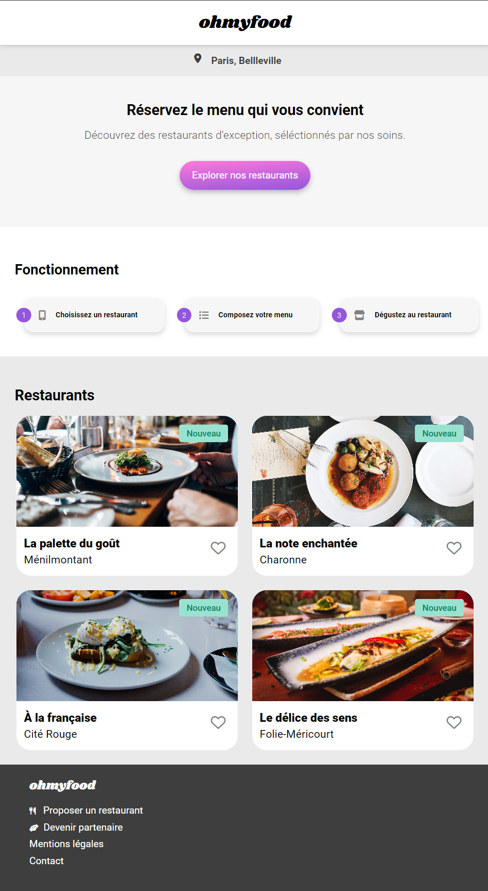

# Ohmyfood-OCR

Project de formation chez OpenClassRoom.

Langage solicité:
- HTML
- CSS
- SASS

# Objectif 

- Maitrise d'animation dynamique CSS.
- Site responsive
- Semblable à la maquette version mobile.

# Maquette

[Figma](https://www.figma.com/file/t4449fzDnwGYmzuwQdu87V/Projet-3-FR---Ohmyfood?node-id=0%3A1)

# Visiter

[Voir le Rendu](https://nerion-1337.github.io/Ohmyfood-OCR/)

# Aperçu

